# Detailed Implementation Architecture with Functions & Data Flow

This document provides a comprehensive architecture diagram showing all functions, their implementations, data structures, and the complete flow including linear interpolation.

## High-Level Detailed Architecture

```mermaid
graph TD
    subgraph LAYER1["📁 FILE LOADING & USER INPUT"]
        FILE_INPUT["👤 User File Selection<br/>HTMLInputElement<br/>accept='.cfg,.dat'"]
        READ_FILES["FileReader API<br/>readAsText(file)"]
    end

    subgraph LAYER2["🔧 PARSING & PROCESSING (comtradeUtils.js)"]
        PARSE_CFG["<b>parseCFG(cfgText, timeUnit)</b><br/>📝 Lines: 1-200<br/>Parameters: string cfgText<br/>Returns: config object<br/><br/>EXTRACT:<br/>1. Header: stationName, deviceID, COMTRADE_rev<br/>2. Channel metadata: id, phase, unit, mult, offset<br/>3. Sampling rates: rate, endSample<br/>4. Times: startDate, triggerTime<br/>5. File type: ASCII or BINARY<br/>6. 2013 extensions: timeCode, localCode"]

        PARSE_DAT["<b>parseDAT(datText, cfg)</b><br/>📝 Lines: 200-400<br/>Parameters: string datText, object cfg<br/>Returns: data object<br/><br/>PROCESS:<br/>1. Split lines, parse sample values<br/>2. Apply multiplier/offset to analog<br/>3. Decode binary if needed<br/>4. Group by analog/digital<br/>5. CALL timeInterpolation functions"]

        INTERPOLATION["⭐ <b>Linear Interpolation</b><br/>📍 utils/timeInterpolation.js<br/>Lines: 1-229<br/><br/>KEY FUNCTIONS:<br/><br/><b>calculateTimeFromSampleNumber()</b><br/>time = sampleNumber / samplingRate<br/>Returns: float seconds<br/><br/><b>generateUniformTimeArray()</b><br/>Loop i=0 to totalSamples:<br/>  time[i] = i / rate<br/>Returns: [0, 0.00025, 0.0005, ...]<br/><br/><b>findSamplingRateForSample()</b><br/>Find applicable rate from samplingRates[]<br/>Handle multi-rate support<br/><br/><b>linearInterpolate(x1,y1,x2,y2,x)</b><br/>slope = (y2-y1)/(x2-x1)<br/>y = y1 + (x-x1)*slope"]

        DATA_RESULT["📊 Final Data Structure<br/>{<br/>  analog: [[time, t1, t2, ...],<br/>          [ch0_val_0, ch0_val_1, ...],<br/>          [ch1_val_0, ch1_val_1, ...],<br/>          ...],<br/>  digital: [...similar],<br/>  cfg: {config object},<br/>  startDate: {DD,MM,YYYY},<br/>  timeArray: [uniform times],<br/>  samplingRates: [{rate,endSample}]<br/>}"]
    end

    subgraph LAYER3["⚙️ REACTIVE STATE MANAGEMENT (createState.js)"]
        STATE_FACTORY["<b>createState(initialState, options)</b><br/>📝 Lines: 1-250<br/>Parameters: any, {batch: bool}<br/>Returns: Proxy object with methods<br/><br/>FEATURES:<br/>- Proxy-based deep reactivity<br/>- Tracks all nested changes<br/>- Path-based subscriptions<br/>- Selector functions<br/>- Batch mode (default true)<br/>- Middleware interceptors<br/>- Error handling"]

        SUBSCRIBE_API["<b>state.subscribe(callback, options)</b><br/>Parameters:<br/>  callback: (change) => void<br/>  options.path: string|array<br/>  options.selector: (state) => any<br/>  options.descendants: bool<br/>  options.batch: bool<br/><br/>Returns: unsubscribe function<br/><br/>Change Object Structure:<br/>{<br/>  path: ['analog', 'yLabels'],<br/>  prop: 'yLabels',<br/>  newValue: [...],<br/>  oldValue: [...],<br/>  root: proxy<br/>  selectorValue: custom<br/>}"]

        CH_STATE["<b>channelState</b><br/>= createState({<br/>  analog: {<br/>    yLabels: string[],<br/>    lineColors: string[],<br/>    channelIDs: string[],<br/>    groups: string[],<br/>    scales: number[],<br/>    units: string[],<br/>    starts: number[],<br/>    durations: number[],<br/>    inverts: boolean[],<br/>    primary: number[],<br/>    secondary: number[],<br/>    skew: number[]<br/>  },<br/>  digital: {<br/>    yLabels: string[],<br/>    lineColors: string[],<br/>    channelIDs: string[],<br/>    groups: string[],<br/>    inverts: boolean[]<br/>  }<br/>})"]

        DATA_STATE["<b>dataState</b><br/>= createState({<br/>  analog: [<br/>    [t0, t1, t2, ..., tn],<br/>    [ch0_s0, ch0_s1, ...],<br/>    [ch1_s0, ch1_s1, ...],<br/>    ...<br/>  ],<br/>  digital: [<br/>    [t0, t1, t2, ..., tn],<br/>    [dig0_s0, dig0_s1, ...],<br/>    [dig1_s0, dig1_s1, ...],<br/>    ...<br/>  ]<br/>})"]

        VERT_STATE["<b>verticalLinesX</b><br/>= createState([])<br/><br/>Array of marker positions<br/>[{x: 0.5, label: 'Fault'},<br/> {x: 1.2, label: 'Event'}]"]
    end

    subgraph LAYER4["📊 CHART INITIALIZATION (uPlot Integration)"]
        CHART_OPTIONS["<b>createChartOptions(type, cfg)</b><br/>📍 components/chartComponent.js<br/>📝 Lines: 34-149<br/><br/>BUILD uPlot configuration:<br/>1. width: DOM container width<br/>2. height: 300px default<br/>3. title: 'Analog' or 'Digital'<br/>4. scales: {<br/>     x: {time scale},<br/>     y0: {left axis},<br/>     y1: {right axis},<br/>     y2: {optional}<br/>   }<br/>5. series: [{<br/>     label: channel name,<br/>     stroke: color hex,<br/>     show: boolean,<br/>     spanGaps: true,<br/>     points: {show: false},<br/>     paths: uPlot.paths.linear()<br/>   }, ...],<br/>6. axes: [x-axis, y-axis config]<br/>7. plugins: [...]<br/>8. hooks: {<br/>     ready: onChartReady(),<br/>     setSize: onSetSize()<br/>   }"]

        INIT_CHART["<b>new uPlot(opts, data, dom)</b><br/>Parameters:<br/>  opts: config from above<br/>  data: dataState[type]<br/>  dom: HTMLElement<br/><br/>Initializes uPlot instance with:<br/>- Canvas rendering context<br/>- Series calculation<br/>- Axis formatting<br/>- Event listeners"]

        RENDER_MAIN["<b>renderComtradeCharts()</b><br/>📍 components/renderComtradeCharts.js<br/>📝 Lines: 23-300+<br/><br/>ORCHESTRATOR FUNCTION:<br/>1. Create container divs<br/>2. Setup ResizableGroup<br/>3. For each channel type:<br/>   a. Auto-group by pattern<br/>   b. Create chart wrapper<br/>   c. Call createChartOptions()<br/>   d. new uPlot(opts, data, dom)<br/>   e. Apply plugins<br/>4. Mount ResizableGroup<br/>5. Setup drag-and-drop<br/>6. Setup keyboard shortcuts"]
    end

    subgraph LAYER5["🔄 REACTIVE UPDATE SYSTEM (chartManager.js)"]
        SUBSCRIBE_CHARTS["<b>subscribeChartUpdates()</b><br/>📍 components/chartManager.js<br/>📝 Lines: 40-150<br/>Parameters:<br/>  channelState: state proxy<br/>  dataState: state proxy<br/>  charts: [uPlot, uPlot]<br/>  container: HTMLElement<br/>  verticalLinesX: state proxy<br/><br/>Setup subscriptions:<br/>1. channelState.subscribe((change) => {<br/>     analyzeChange(change)<br/>     decideUpdateStrategy()\n     applyUpdates()\n   })<br/>2. dataState.subscribe(...)<br/>3. verticalLinesX.subscribe(...)"]

        CHANGE_DETECTION["CHANGE ANALYSIS<br/>Check what changed:<br/>1. Color changed?<br/>   → Cheap: series.stroke<br/>2. Label changed?<br/>   → Cheap: series.label<br/>3. Channel added/removed?<br/>   → Expensive: recreate<br/>4. Axes changed?<br/>   → Expensive: recreate<br/>5. Data changed?<br/>   → Medium: setData()<br/>6. Invert toggled?<br/>   → Medium: flip amplitudes"]

        UPDATE_STRATEGY["UPDATE DECISION TREE<br/>If cheap operation:<br/>  → Modify series in-place<br/>  → chart.setSeries(index, newSeries)<br/>  → chart.setStroke(index, color)<br/>Else if structural:<br/>  → chart.destroy()<br/>  → recreateChart(type)<br/>Else if data change:<br/>  → chart.setData(newData)"]

        APPLY_UPDATES["APPLY TO uPlot<br/>Methods:<br/>- chart.setData(data)<br/>- chart.setScale(key, scale)<br/>- chart.setSeries(idx, series)<br/>- chart.setSize(w, h)<br/>- chart.setSelect(range)<br/>- chart.destroy()"]

        RAF_BATCH["<b>requestAnimationFrame</b><br/>📍 utils/requestAnimationFrameUpdates.js<br/><br/>Batch all updates:<br/>1. Collect state changes<br/>2. Batch: true (default)<br/>3. Schedule single RAF call<br/>4. Apply all updates once<br/>5. Single reflow/repaint"]
    end

    subgraph LAYER6["📋 CHANNEL EDITOR - TABULATOR INTEGRATION"]
        OPEN_WINDOW["<b>showChannelListWindow()</b><br/>📍 components/showChannelListWindow.js<br/><br/>1. Create popup window:<br/>   childWin = window.open()<br/>2. Build HTML for Tabulator<br/>3. Load Tabulator library<br/>4. Define table columns"]

        TABULATOR_COLS["Tabulator Column Definitions:<br/>- type: select editor<br/>  options: ['Analog','Digital']<br/>- id: text (read-only)<br/>- name: text editor<br/>- unit: text editor<br/>- group: select editor<br/>- color: color picker editor<br/>- scale: number editor<br/>- start: number editor<br/>- duration: number editor<br/>- invert: checkbox editor<br/>- Delete: button"]

        EDIT_ROWS["User Edits Table Rows<br/>Each edit triggers:<br/>editable cell update<br/>  → table.on('cellEdited', ...)"]

        CHILD_LISTENER["<b>Child Window Message Handler</b><br/>📍 Tabulator window (child)<br/><br/>table.on('cellEdited', (cell) => {<br/>  field = cell.getColumn().getField()<br/>  oldValue = row[field]<br/>  newValue = cell.getValue()<br/><br/>  parentWindow.postMessage({<br/>    source: 'ChildWindow',<br/>    type: CALLBACK_TYPE[field],<br/>    payload: {<br/>      field,<br/>      newValue,<br/>      oldValue,<br/>      channelID,<br/>      row<br/>    }<br/>  })<br/>})"]

        CALLBACK_MSGS["Callback Message Types<br/>📍 main.js Lines: 105-115<br/><br/>CALLBACK_TYPE = {<br/>  COLOR: 'callback_color',<br/>  SCALE: 'callback_scale',<br/>  START: 'callback_start',<br/>  DURATION: 'callback_duration',<br/>  INVERT: 'callback_invert',<br/>  CHANNEL_NAME: 'callback_channelName',<br/>  GROUP: 'callback_group',<br/>  ADD_CHANNEL: 'callback_addChannel',<br/>  DELETE: 'callback_delete',<br/>  UNIT: 'callback_unit'<br/>}"]

        PARENT_HANDLER["<b>Parent Message Handler</b><br/>📍 main.js Lines: 800+<br/><br/>window.addEventListener('message', (e) => {<br/>  if (e.data.source !== 'ChildWindow')<br/>    return<br/><br/>  const {type, payload} = e.data<br/>  const {channelID, newValue} = payload<br/><br/>  if (type === CALLBACK_TYPE.COLOR)<br/>    channelState[type].lineColors[idx] = newValue<br/>  else if (type === CALLBACK_TYPE.SCALE)<br/>    channelState[type].scales[idx] = newValue<br/>  else if (type === CALLBACK_TYPE.INVERT)<br/>    channelState[type].inverts[idx] = newValue<br/>  ...<br/>})"]
    end

    subgraph LAYER7["👆 USER INTERACTION HANDLERS"]
        DRAG_BAR["<b>createDragBar()</b><br/>📍 components/createDragBar.js<br/><br/>Creates draggable element:<br/>- DOM: div with drag handle icon<br/>- Color swatch<br/>- Channel label<br/>- Live label subscriptions<br/><br/>Event listeners:<br/>mousedown → dragStart<br/>mousemove → dragMove<br/>mouseup → dragEnd<br/><br/>Updates: verticalLinesX.push({x})"]

        SHORTCUTS["<b>handleVerticalLineShortcuts()</b><br/>📍 components/handleVerticalLineShortcuts.js<br/><br/>Keyboard event handlers:<br/>- ArrowLeft/Right: Move line ±0.01<br/>- ArrowUp/Down: Move line ±0.001<br/>- Delete: Remove selected line<br/>- Ctrl+Z: Undo<br/>- Plus/Minus: Adjust step size<br/><br/>Updates: verticalLinesX array"]

        ZOOM_PAN["<b>horizontalZoomPanPlugin</b><br/>📍 plugins/horizontalZoomPanPlugin.js<br/><br/>Event handling:<br/>Wheel event:<br/>  → Zoom in/out<br/>  → Calculate new scale<br/>  → chart.setScale('x', newScale)<br/><br/>Drag event:<br/>  → Pan horizontally<br/>  → Update x-axis range"]

        REORDER["<b>setupChartDragAndDrop()</b><br/>📍 components/setupChartDragAndDrop.js<br/><br/>Drag channel groups:<br/>dragstart → Store source index<br/>dragover → Show drop target<br/>drop → Reorder channels<br/>  → Modify channelState<br/>  → Chart recreates with new order"]
    end

    subgraph LAYER8["🔌 PLUGINS & ADVANCED FEATURES"]
        VERT_PLUGIN["<b>verticalLinePlugin</b><br/>📍 plugins/verticalLinePlugin.js<br/><br/>Renders vertical overlay lines:<br/>- Subscribe to verticalLinesX<br/>- For each line:<br/>  draw vertical line at x pos<br/>  draw label tooltip<br/>- Sync across both charts<br/>- Update on verticalLinesX change"]

        DIGITAL_FILL["<b>digitalFillPlugin</b><br/>📍 plugins/digitalFillPlugin.js<br/><br/>Enhanced digital signal display:<br/>- Fill areas under curve<br/>- Color by state (high/low)<br/>- Improves readability<br/>- 50% opacity fill"]

        AUTO_SCALE["<b>autoUnitScalePlugin</b><br/>📍 plugins/autoUnitScalePlugin.js<br/><br/>Intelligent unit scaling:<br/>- Analyze data range<br/>- Select unit: mV, V, kV<br/>- Auto-scale axis<br/>- Update series colors<br/>- Change scale label"]

        DELTA_BOX["<b>deltaBoxPlugin</b><br/>📍 plugins/deltaBoxPlugin.js<br/><br/>Value difference display:<br/>- Show on hover<br/>- Calculate: Δ = v2 - v1<br/>- Show %: (Δ/v1)*100<br/>- Uses calculateDeltas()"]
    end

    subgraph LAYER9["🔧 UTILITY LAYER & HELPERS"]
        TIME_UTILS["<b>timeInterpolation.js</b><br/>📍 utils/timeInterpolation.js<br/>📝 Lines: 1-229<br/><br/>Exported Functions:<br/>1. calculateTimeFromSampleNumber(n, rates)<br/>2. generateUniformTimeArray(total, rates)<br/>3. linearInterpolate(x1,y1,x2,y2,x)<br/>4. findSamplingRateForSample(n, rates)"]

        DELTA_UTILS["<b>calculateDeltas()</b><br/>📍 utils/calculateDeltas.js<br/><br/>Calculates differences:<br/>- Input: val1, val2<br/>- Output: {delta, percent}"]

        DOM_UTILS["<b>chartDomUtils</b><br/>📍 utils/chartDomUtils.js<br/><br/>- querySelector helpers<br/>- createElement factory<br/>- addClass/removeClass<br/>- getBoundingClientRect()"]

        HELPERS["<b>helpers.js</b><br/>📍 utils/helpers.js<br/><br/>- createCustomElement()<br/>- formatValue(num, precision)<br/>- parseColorHex()<br/>- debounce()<br/>- throttle()"]

        CONSTANTS["<b>constants.js</b><br/>📍 utils/constants.js<br/><br/>Color palettes:<br/>- analogPalette: 12 colors<br/>- digitalPalette: 6 colors<br/>- Unit definitions<br/>- Scale presets"]

        AUTO_GROUP_UTIL["<b>autoGroupChannels()</b><br/>📍 utils/autoGroupChannels.js<br/><br/>Intelligent grouping:<br/>- Extract prefixes<br/>- Match units<br/>- Group A/B/C phases<br/>- Assign colors per group"]
    end

    FILE_INPUT --> READ_FILES
    READ_FILES --> PARSE_CFG & PARSE_DAT
    PARSE_CFG --> INTERPOLATION
    PARSE_DAT --> INTERPOLATION
    INTERPOLATION --> DATA_RESULT

    DATA_RESULT --> STATE_FACTORY
    STATE_FACTORY --> SUBSCRIBE_API
    SUBSCRIBE_API --> CH_STATE & DATA_STATE & VERT_STATE

    CH_STATE & DATA_STATE --> CHART_OPTIONS
    CHART_OPTIONS --> INIT_CHART
    INIT_CHART --> RENDER_MAIN

    RENDER_MAIN --> SUBSCRIBE_CHARTS
    CH_STATE & DATA_STATE & VERT_STATE --> SUBSCRIBE_CHARTS
    SUBSCRIBE_CHARTS --> CHANGE_DETECTION
    CHANGE_DETECTION --> UPDATE_STRATEGY
    UPDATE_STRATEGY --> APPLY_UPDATES
    APPLY_UPDATES --> RAF_BATCH

    OPEN_WINDOW --> TABULATOR_COLS
    TABULATOR_COLS --> EDIT_ROWS
    EDIT_ROWS --> CHILD_LISTENER
    CHILD_LISTENER --> CALLBACK_MSGS
    CALLBACK_MSGS --> PARENT_HANDLER
    PARENT_HANDLER --> CH_STATE & DATA_STATE

    DRAG_BAR --> VERT_STATE
    SHORTCUTS --> VERT_STATE
    ZOOM_PAN --> APPLY_UPDATES
    REORDER --> CH_STATE

    VERT_STATE --> VERT_PLUGIN
    VERT_PLUGIN --> RAF_BATCH

    DATA_STATE --> DIGITAL_FILL
    DIGITAL_FILL --> RAF_BATCH

    CH_STATE --> AUTO_SCALE
    AUTO_SCALE --> CHART_OPTIONS

    CH_STATE & DATA_STATE --> DELTA_BOX
    DELTA_BOX --> RAF_BATCH

    INTERPOLATION --> TIME_UTILS
    DELTA_BOX --> DELTA_UTILS
    RENDER_MAIN --> DOM_UTILS
    DRAG_BAR --> HELPERS
    AUTO_GROUP_UTIL --> CH_STATE

    style INTERPOLATION fill:#FFF9C4,stroke:#F57F17,stroke-width:3px,color:#000
    style TIME_UTILS fill:#FFF9C4,stroke:#F57F17,stroke-width:3px,color:#000
    style PARSE_DAT fill:#BBDEFB,stroke:#1565C0,stroke-width:2px,color:#000
    style PARSE_CFG fill:#BBDEFB,stroke:#1565C0,stroke-width:2px,color:#000
    style STATE_FACTORY fill:#C8E6C9,stroke:#2E7D32,stroke-width:2px,color:#000
    style SUBSCRIBE_API fill:#C8E6C9,stroke:#2E7D32,stroke-width:2px,color:#000
    style SUBSCRIBE_CHARTS fill:#C8E6C9,stroke:#2E7D32,stroke-width:2px,color:#000
    style CHART_OPTIONS fill:#FFE0B2,stroke:#E65100,stroke-width:2px,color:#000
    style RENDER_MAIN fill:#FFE0B2,stroke:#E65100,stroke-width:2px,color:#000
```



## Implementation Details by Layer

### Layer 1: File Loading

- **Input**: User selects .cfg and .dat files via HTML file input
- **Output**: Raw text content of both files
- **Technology**: FileReader API with `readAsText()`

### Layer 2: Parsing & Processing

**Key Files**: `src/components/comtradeUtils.js`, `src/utils/timeInterpolation.js`

#### parseCFG Function

```javascript
export function parseCFG(cfgText, timeUnit = 'microseconds') {
  // 1. Split text by lines
  // 2. Parse header: stationName, deviceID, COMTRADE_rev
  // 3. Extract channel counts: TT, A, D
  // 4. Parse analog channels (rows 2 to 2+A)
  // 5. Parse digital channels (rows 2+A to 2+A+D)
  // 6. Parse sampling rates (supports multiple rates)
  // 7. Extract time information
  // 8. Parse timemult and file type
  // 9. Handle 2013 extensions
  return { stationName, analogChannels, digitalChannels, samplingRates, ... }
}
```

#### parseDAT Function with Linear Interpolation

```javascript
export function parseDAT(datText, cfg, timeUnit = 'seconds') {
  // 1. Parse first line to get total samples
  // 2. Initialize arrays for analog and digital data
  // 3. For each sample line:
  //    - Parse values
  //    - Apply multiplier/offset to analog
  // 4. CREATE TIME ARRAY using calculateTimeFromSampleNumber()
  timeArray = generateUniformTimeArray(totalSamples, cfg.samplingRates)
  // 5. Return data with uniform time spacing
  return {
    analog: [[timeArray], [ch0_values], [ch1_values], ...],
    digital: [[timeArray], [dig0_values], ...],
    cfg: cfg,
    timeArray: timeArray
  }
}
```

#### Linear Interpolation Implementation

```javascript
// Located in utils/timeInterpolation.js

export function calculateTimeFromSampleNumber(sampleNumber, samplingRates) {
  const samplingRate = findSamplingRateForSample(sampleNumber, samplingRates);
  return sampleNumber / samplingRate; // uniform time spacing
}

export function generateUniformTimeArray(totalSamples, samplingRates) {
  const timeArray = [];
  for (let i = 0; i < totalSamples; i++) {
    timeArray.push(calculateTimeFromSampleNumber(i, samplingRates));
  }
  return timeArray; // [0, 0.00025, 0.0005, 0.00075, ...]
}

export function findSamplingRateForSample(sampleNumber, samplingRates) {
  for (let sr of samplingRates) {
    if (sampleNumber <= sr.endSample) {
      return sr.rate;
    }
  }
  return samplingRates[samplingRates.length - 1].rate;
}
```

### Layer 3: Reactive State Management

**File**: `src/components/createState.js`

The state management system uses JavaScript Proxies for deep reactivity:

```javascript
export const channelState = createState({
  analog: {
    yLabels: ['Phase A', 'Phase B', ...],
    lineColors: ['#FF0000', '#00FF00', ...],
    channelIDs: ['id1', 'id2', ...],
    scales: [1, 1, ...],
    units: ['V', 'V', ...],
    starts: [0, 0, ...],
    durations: [10, 10, ...],
    inverts: [false, false, ...]
  },
  digital: {...}
})

export const dataState = createState({
  analog: [[t0, t1, ...], [val0, val1, ...], ...],
  digital: [[t0, t1, ...], [dig0, dig1, ...], ...]
})

export const verticalLinesX = createState([])
```

### Layer 4: Chart Initialization

**Files**: `src/components/chartComponent.js`, `src/components/renderComtradeCharts.js`

#### createChartOptions

Builds uPlot configuration with scales, series, axes, and plugins.

#### renderComtradeCharts

Main orchestrator that:

1. Creates container DOM structure
2. Auto-groups channels
3. Calls createChartOptions for each group
4. Instantiates uPlot
5. Attaches plugins

### Layer 5: Reactive Update System

**File**: `src/components/chartManager.js`

```javascript
export function subscribeChartUpdates(
  channelState,
  dataState,
  charts,
  chartsContainer,
  verticalLinesX
) {
  // Subscribe to channelState changes
  channelState.subscribe((change) => {
    analyzeChange(change);
    if (isCheapUpdate) {
      updateSeriesInPlace();
    } else if (isStructuralChange) {
      recreateChart();
    } else {
      updateData();
    }
  });
}
```

### Layer 6: Channel Editor

**File**: `src/components/showChannelListWindow.js`

Uses Tabulator.js for editable table in popup window:

- Parent ↔ Child window communication via postMessage
- Child sends callback messages with edited values
- Parent updates channelState/dataState
- Charts automatically update via subscriptions

### Layer 7: User Interactions

Various handlers for:

- Dragging vertical measurement lines
- Keyboard shortcuts for line control
- Zoom/Pan with mouse wheel and drag
- Reordering channels via drag-and-drop

### Layer 8: Plugins

Custom uPlot plugins for:

- Vertical line overlays
- Digital signal fill
- Automatic unit scaling
- Delta value display

### Layer 9: Utilities

Supporting functions for time interpolation, calculations, DOM manipulation, and helpers.

---

## Data Flow Summary

1. **User loads files** → FileReader API extracts text
2. **parseCFG()** → Configuration with samplingRates
3. **parseDAT()** + **Linear Interpolation** → Uniform time array
4. **createState()** → Reactive channelState & dataState
5. **renderComtradeCharts()** → Initialize uPlot with data
6. **subscribeChartUpdates()** → Monitor state changes
7. **User edits in Tabulator** → Child window sends callback
8. **Parent updates state** → Triggers chart update subscription
9. **Update logic decides** → In-place update or full recreate
10. **Charts re-render** → Batched via requestAnimationFrame
