# COMTRADE Architecture - Diagram Type Analysis & Recommendations

## Executive Summary

After analyzing the 6 flowcharts in the current architecture documentation, here are the recommendations for diagram improvements:

---

## Current Flowcharts vs. Better Alternatives

### 1️⃣ Data Flow - File Loading & Parsing

**Current:** Linear Flowchart  
**Status:** ✅ GOOD  
**Why:** Shows simple linear progression from file input to output  
**Could be enhanced with:** SEQUENCE DIAGRAM

**Recommendation - Sequence Diagram:**

```
Sequence Diagram: "File Loading Process"
- User browser
- main.js
- comtradeUtils.js
- createState.js
- renderComtradeCharts.js

Timeline:
1. User clicks Load → main.js handleLoadFiles()
2. main.js → comtradeUtils.js parseCFG()
3. main.js → comtradeUtils.js parseDAT()
4. main.js → createState.js createState()
5. main.js → renderComtradeCharts.js render()
6. renderComtradeCharts.js → Browser [charts displayed]
```

**Benefit:** Shows timing, interaction order, and which components communicate with which

---

### 2️⃣ Chart Rendering Pipeline

**Current:** Top-Down Flowchart  
**Status:** ⚠️ COULD BE BETTER  
**Why:** Shows decision branches but misses detailed steps  
**Better option:** FLOWCHART + SEQUENCE DIAGRAM combo

**Recommendation - Detailed Sequence Diagram:**

```
Sequence Diagram: "Chart Rendering Orchestration"
- renderComtradeCharts.js (main)
- chartComponent.js
- createDragBar.js
- Browser DOM

Interactions:
1. renderComtradeCharts → chartComponent: autoGroupChannels()
2. chartComponent → createDragBar: createDragBar()
3. createDragBar → DOM: insertElement()
4. chartComponent → chartComponent: createChartOptions()
5. chartComponent → Browser: initUPlotChart()
6. Browser → renderComtradeCharts: charts ready callback
```

**Benefit:** Shows exact order of operations and component communication

---

### 3️⃣ Reactive State Management

**Current:** State Detection Flowchart  
**Status:** ❌ SHOULD BE STATE DIAGRAM  
**Why:** This is EXACTLY what state diagrams are for!  
**Better option:** STATE DIAGRAM

**Recommendation - State Diagram:**

```
State Diagram: "State Change Detection & Handling"

States:
- [Idle] → State Change Detected
- [State Change Detected] → Branching
  - Color/Label Change → [In-Place Update] → [UI Updated]
  - Scale/Group Change → [Full Rebuild] → [UI Updated]
  - Time Window Change → [Zoom/Pan] → [UI Updated]
  - Add/Delete Channel → [Full Rebuild] → [UI Updated]
- [UI Updated] → [Idle]

State Details:
- Idle: Waiting for user input or state change
- In-Place Update: lightningbolt (fast), only CSS/label changes
- Full Rebuild: Slower, destroys and recreates charts
- Zoom/Pan: Only scale adjustment
- UI Updated: Notifies all subscribers
```

**Benefit:** Visual representation of states and transitions is much clearer

---

### 4️⃣ User Interaction Handlers

**Current:** Action Type Flowchart  
**Status:** ⚠️ MIXED USAGE  
**Why:** Shows action branching but misses event flow  
**Better option:** COMBINATION - Event Sequence + State Diagram

**Recommendation - Sequence Diagram:**

```
Sequence Diagram: "User Interaction & State Update"
- Browser (User)
- Event Listener
- State Management (createState.js)
- chartManager.js
- Chart

Timeline:
1. User [mouse move] → Event Listener
2. Event Listener → Tooltip.js [show values]
3. Event Listener → State [verticalLinesX update]
4. State → chartManager [subscriber notification]
5. chartManager → Chart [redraw markers]
6. Chart → Browser [visual update]
```

**Benefit:** Shows actual event flow with timing

**Also useful:** TIMELINE DIAGRAM for keyboard shortcuts

```
Timeline: "Undo/Redo Operations"
- T0: User presses Ctrl+Z
- T1: createState detects undo trigger
- T2: History stack popped
- T3: Old value restored to state
- T4: Subscribers notified
- T5: Chart recreation triggered
- T6: UI reflects previous state
```

---

### 5️⃣ Channel Editor Interface

**Current:** Linear Communication Flowchart  
**Status:** ⚠️ GOOD but needs SEQUENCE DIAGRAM  
**Why:** Parent-child communication pattern  
**Better option:** SEQUENCE DIAGRAM

**Recommendation - Sequence Diagram:**

```
Sequence Diagram: "Parent-Child Channel Editor Communication"
- User (in main window)
- main.js (Parent)
- showChannelListWindow.js (Child Window)
- Tabulator (Table)
- chartManager.js

Timeline:
1. User → main.js [clicks Edit Channels]
2. main.js → showChannelListWindow [window.open()]
3. showChannelListWindow → Tabulator [load table]
4. Tabulator → showChannelListWindow [display ready]
5. User → Tabulator [edit cell]
6. Tabulator → showChannelListWindow [cellEdited event]
7. showChannelListWindow → main.js [postMessage callback_color]
8. main.js → main.js [updateChannelFieldByID()]
9. main.js → chartManager [trigger subscribers]
10. chartManager → Browser [update charts]
```

**Benefit:** Crystal clear parent-child message flow

---

### 6️⃣ Plugin System

**Current:** Hub-and-Spoke Flowchart  
**Status:** ✅ ACCEPTABLE  
**Why:** Shows how plugins branch from main system  
**Could add:** ARCHITECTURE DIAGRAM or CLASS DIAGRAM

**Recommendation - Architecture Diagram:**

```
Architecture Diagram: "Plugin Architecture Pattern"
Shows:
- chartComponent.js as central hub
- Each plugin as separate module
- Plugin interfaces/contracts
- How plugins hook into chart lifecycle

Could also use:
CLASS DIAGRAM showing:
- Plugin base class/interface
- Each plugin implementation
- Methods each plugin must implement
```

**Benefit:** Shows design pattern and extensibility

---

## Summary Table: Recommended Diagram Enhancements

| Current Diagram     | Section         | Recommended Type(s)            | Why                           | Priority |
| ------------------- | --------------- | ------------------------------ | ----------------------------- | -------- |
| 1. Data Flow        | File Loading    | **Sequence Diagram**           | Shows timing & dependencies   | Medium   |
| 2. Chart Rendering  | Pipeline        | **Sequence + Flowchart**       | Shows both process AND timing | High     |
| 3. State Management | Reactive System | **State Diagram**              | Perfect for state transitions | High ⭐  |
| 4. User Interaction | Handlers        | **Sequence + Timeline**        | Event flow & timing           | High     |
| 5. Channel Editor   | Communication   | **Sequence Diagram**           | Parent-child interaction      | Medium   |
| 6. Plugin System    | Features        | **Architecture/Class Diagram** | Design pattern documentation  | Low      |

---

## Recommended New Diagrams to Add

### A. CLASS DIAGRAM - For Understanding Data Structures

```
Shows:
- State object structure
- Channel object structure
- Chart configuration object
- Message payload structure
- Plugin interface
```

### B. TIMELINE DIAGRAM - For Performance Analysis

```
Timeline: "Complete Application Startup"
- T0ms: User opens file
- T10ms: CFG parsing begins
- T20ms: DAT parsing begins
- T50ms: State initialization
- T80ms: Chart rendering starts
- T150ms: First chart rendered
- T200ms: All charts rendered
- T210ms: Ready for interaction
```

### C. ACTIVITY DIAGRAM - For Complex Processes

```
Activity Diagram: "Chart Update Decision Tree"
Shows the complex decision logic in chartManager.js
for determining update strategy
```

### D. ENTITY-RELATIONSHIP DIAGRAM - For Data Relationships

```
Shows:
- How channelState relates to dataState
- How channels relate to charts
- How charts relate to DOM elements
```

---

## Implementation Recommendations

### Phase 1: High Priority (Add Immediately)

1. **Section 3 (State Management):** Replace with STATE DIAGRAM
2. **Section 4 (User Interaction):** Add SEQUENCE DIAGRAM variant
3. **Section 2 (Chart Rendering):** Add companion SEQUENCE DIAGRAM

### Phase 2: Medium Priority (Add Soon)

1. **Section 1 (Data Flow):** Add SEQUENCE DIAGRAM
2. **Section 5 (Channel Editor):** Replace/enhance with SEQUENCE DIAGRAM
3. Add **CLASS DIAGRAM** for data structures

### Phase 3: Low Priority (Polish)

1. **Section 6 (Plugin System):** Add ARCHITECTURE DIAGRAM
2. Add **TIMELINE DIAGRAM** for performance
3. Add **ACTIVITY DIAGRAM** for complex decisions

---

## Best Suited Diagram Types for This Project

### ✅ SEQUENCE DIAGRAMS - USE CASES:

1. **File Loading Process** (Section 1)
   - Shows interaction between: browser → main.js → utilities → state → render
2. **Channel Editor Communication** (Section 5)
   - Shows: parent window ↔ child window message flow
3. **User Interaction Events** (Section 4)
   - Shows: user input → handler → state → subscribers → UI

### ✅ STATE DIAGRAMS - USE CASES:

1. **Reactive State Management** (Section 3) ⭐ PRIMARY
   - Perfect for showing state transitions: Idle → Update Detected → Processing → Updated
2. **Chart Update Types**
   - Shows: Initial → Waiting → InPlace/Full Rebuild/Zoom → Done

### ✅ FLOWCHART (Current) - KEEP FOR:

1. **Data Flow** (Section 1) - Already good
2. **Chart Rendering Pipeline** (Section 2) - Shows decision branches well
3. **Plugin System** (Section 6) - Shows how features branch

### ✅ TIMELINE DIAGRAMS - NEW USE CASES:

1. **Application Startup** - Performance analysis
2. **User Interaction Sequence** - Step-by-step timing
3. **Undo/Redo History** - State restoration timeline

### ✅ CLASS DIAGRAMS - NEW USE CASES:

1. **Data Structure Overview** - channelState, dataState, chart objects
2. **Plugin Architecture** - Base class + implementations
3. **Message Types** - All message structure definitions

### ✅ ARCHITECTURE DIAGRAMS - NEW USE CASES:

1. **Plugin System** (Section 6) - Shows extensibility pattern
2. **Module Dependencies** - How files depend on each other
3. **Communication Patterns** - Parent-child, pub-sub, direct calls

---

## Mermaid Syntax Examples

### State Diagram Example (for Section 3):

```mermaid
stateDiagram-v2
    [*] --> Idle
    Idle --> ChangeDetected: State Change
    ChangeDetected --> Decision{Update Type?}
    Decision -->|Color/Label| InPlace
    Decision -->|Scale/Group| FullRebuild
    Decision -->|Time Window| ZoomPan
    Decision -->|Add/Delete| FullRebuild
    InPlace --> Sync[Sync Charts]
    FullRebuild --> Sync
    ZoomPan --> Sync
    Sync --> UIUpdated
    UIUpdated --> [*]
```

### Sequence Diagram Example (for Section 1):

```mermaid
sequenceDiagram
    participant User as 👤 User
    participant Main as main.js
    participant Utils as comtradeUtils.js
    participant State as createState.js
    participant Render as renderComtradeCharts.js

    User->>Main: Load CFG/DAT Files
    Main->>Utils: parseCFG()
    Utils-->>Main: cfg object
    Main->>Utils: parseDAT()
    Utils-->>Main: data object
    Main->>State: createState()
    State-->>Main: state proxy
    Main->>Render: renderComtradeCharts()
    Render-->>Main: charts ready
```



### Timeline Diagram Example (for new section):


---

## Conclusion

**Main Finding:** The current flowchart-only approach is functional but misses opportunities for clarity:

1. **State Diagram (3️⃣)** should REPLACE current flowchart - it's the perfect pattern
2. **Sequence Diagrams (1️⃣, 2️⃣, 4️⃣, 5️⃣)** should SUPPLEMENT flowcharts for clarity on timing
3. **Keep Flowcharts** for high-level decision logic (sections 2, 6)
4. **Add Class Diagrams** for data structure documentation
5. **Add Timeline Diagrams** for performance visualization

**Recommended Action:** Start with Section 3 (State Diagram) as it has the highest improvement potential and is most commonly misrepresented as flowchart.
