# COMTRADE v1 - Advanced Flowcharts & Detailed System Analysis

## 11. Detailed Channel Update by Index Flow (With Validation)

```mermaid
flowchart TD
    A["🎯 updateChannelFieldByIndex<br/>Input: type, idx, fieldName, value"]
    A --> B{"Input Validation:<br/>type ∈ {analog, digital}?"}
    B -->|Invalid| B1["❌ Return false"]
    B -->|Valid| C["Get State Section:<br/>s = channelState[type]"]

    C --> D{"Section<br/>Exists?"}
    D -->|No| B1
    D -->|Yes| E["Initialize Target Array<br/>if Undefined:<br/>s[fieldName] = []"]

    E --> F["Get Array Reference:<br/>arr = s[fieldName]"]
    F --> G{"Is Array?"}
    G -->|No| B1
    G -->|Yes| H["Convert Index:<br/>i = Number(idx)"]

    H --> I["🔍 Validation Checks:<br/>1. Number.isFinite(i)?<br/>2. i >= 0?<br/>3. i < arr.length?"]
    I --> J{"All Valid?"}
    J -->|No| J1["Log: 'Out of Bounds'<br/>Return false"]
    J -->|Yes| K["📝 Perform Update:<br/>arr[i] = value"]

    K --> L["🔔 Trigger Subscribers<br/>via Reactive System"]
    L --> M["Log: 'ok'"]
    M --> N["✅ Return true"]

    style A fill:#E3F2FD,stroke:#1565C0,color:#000
    style B fill:#FFF3E0,stroke:#E65100,color:#000
    style I fill:#FFF9C4,stroke:#F57F17,color:#000
    style K fill:#F3E5F5,stroke:#6A1B9A,color:#fff
    style N fill:#C8E6C9,stroke:#2E7D32,color:#000
    style B1 fill:#FFCDD2,stroke:#C62828,color:#000
```

---

## 12. Array Synchronization in deleteChannelByID

```mermaid
flowchart TD
    A["🗑️ Delete Channel at Index i"]
    A --> B["Arrays to Splice:<br/>perChannelArrays = [<br/>yLabels, lineColors,<br/>yUnits, groups,<br/>axesScales, scales,<br/>starts, durations,<br/>inverts, channelIDs<br/>]"]

    B --> C["For Each Array Name<br/>in perChannelArrays"]
    C --> D{"Array<br/>Exists &<br/>Is Valid?"}
    D -->|No| E["Skip Array"]
    D -->|Yes| F{"Index<br/>in Bounds?"}
    F -->|No| E
    F -->|Yes| G["🔀 Splice(i, 1)<br/>Remove Element"]

    E --> H["Next Array"]
    G --> H
    H --> I{"More<br/>Arrays?"}
    I -->|Yes| C
    I -->|No| J["Remove Series from<br/>dataState[type]"]

    J --> K["Calculate seriesIdx<br/>= i + 1<br/>offset for time array"]
    K --> L{"Series Exists<br/>& in Bounds?"}
    L -->|Yes| M["🔀 Splice dataState"]
    L -->|No| N["Skip dataState"]

    M --> O["Remove Series from<br/>raw data[type]"]
    N --> O

    O --> P{"Series Exists<br/>& in Bounds?"}
    P -->|Yes| Q["🔀 Splice raw data"]
    P -->|No| R["Skip raw data"]

    Q --> S["✅ All Arrays<br/>Synchronized"]
    R --> S
    S --> T["🔔 Trigger<br/>channelIDs Subscriber"]
    T --> U["📊 Chart<br/>Recreates"]
    U --> V["Return true"]

    style A fill:#F44336,stroke:#B71C1C,color:#fff
    style B fill:#FFF3E0,stroke:#E65100,color:#000
    style G fill:#FFCCBC,stroke:#D84315,color:#000
    style S fill:#FFFDE7,stroke:#F57F17,color:#000
    style V fill:#C8E6C9,stroke:#2E7D32,color:#000
```

---

## 13. Complex Message Routing with Fallback Logic

```mermaid
flowchart TD
    A["📨 Message Received"]
    A --> B["Extract payload"]

    B --> C{"Has<br/>channelID?"}
    C -->|Yes| C1["🔍 findChannelByID<br/>Get type & idx"]
    C1 --> C2["Call updateChannelFieldByID<br/>with field mapping"]
    C2 --> C3{"Update<br/>Successful?"}
    C3 -->|Yes| D["✅ Done"]
    C3 -->|No| C4["⚠️ Fall through<br/>to legacy"]

    C -->|No| E["Check row Object"]
    E --> E1{"Has<br/>row?"}
    E1 -->|No| E2["🛑 Return Early"]
    E1 -->|Yes| E3["Extract row.type<br/>& row properties"]

    E3 --> E4{"row.id<br/>Type?"}
    E4 -->|String| E5["Lookup by Label<br/>indexOf(row.id)<br/>in yLabels"]
    E4 -->|Number| E6["Convert 1-Based<br/>to 0-Based:<br/>idx = row.id - 1"]
    E4 -->|Missing| E7["⚠️ Skip Legacy"]

    E5 --> E8{"Label<br/>Found?"}
    E6 --> E9{"Valid<br/>Index?"}
    E8 -->|Yes| E10["Get Index"]
    E8 -->|No| E11["Log: 'not-found'"]
    E9 -->|Yes| E10
    E9 -->|No| E11
    E7 --> E11

    E10 --> F["🎯 updateChannelFieldByIndex<br/>type, idx, field, value"]
    E11 --> E2
    C4 --> E
    F --> D

    D --> G["🔔 Trigger<br/>Subscribers"]
    G --> H["📊 Update Chart"]

    style A fill:#E3F2FD,stroke:#1565C0,color:#000
    style C1 fill:#BBDEFB,stroke:#0D47A1,color:#000
    style E5 fill:#FFF9C4,stroke:#F57F17,color:#000
    style E6 fill:#FFE0B2,stroke:#E65100,color:#000
    style F fill:#F3E5F5,stroke:#6A1B9A,color:#fff
    style D fill:#C8E6C9,stroke:#2E7D32,color:#000
    style E2 fill:#FFCDD2,stroke:#C62828,color:#000
```

---

## 14. Group Edit Persistence Complete Lifecycle

```mermaid
flowchart TD
    subgraph "Step 1: User Action"
        U1["👤 User Opens<br/>Channel List Popup"]
        U2["showChannelListWindow<br/>Called"]
    end

    subgraph "Step 2: Initial Display"
        D1["Read channelState<br/>groups arrays"]
        D2{"Groups Array<br/>Has Values?"}
        D2 -->|Yes| D3["Use Persisted<br/>Group Names"]
        D2 -->|No| D4["Compute Auto-Groups<br/>via autoGroupChannels"]
        D3 --> D5["Build channelListCfg<br/>with group property"]
        D4 --> D5
    end

    subgraph "Step 3: Tabulator Display"
        TB1["Tabulator Renders<br/>Columns including<br/>group"]
        TB2["👁️ User Sees<br/>Group Names"]
    end

    subgraph "Step 4: Edit"
        E1["User Edits Group Cell<br/>e.g., 'Current' → 'Other'"]
        E2["Tabulator cellEdited<br/>Event Fires"]
        E3["Extract:<br/>row.id, field, newValue"]
    end

    subgraph "Step 5: Send Message"
        M1["Detect field = 'group'"]
        M2["Construct Payload:<br/>{row, newValue}"]
        M3["Set type = callback_update"]
        M4["📤 postMessage<br/>to Parent"]
    end

    subgraph "Step 6: Parent Reception"
        PR1["Parent message handler"]
        PR2["Extract payload.field<br/>= 'group'"]
        PR3["Extract row.type &<br/>row.id"]
        PR4{"row.id Type?"}
        PR4 -->|String| PR5["Label-Based Lookup"]
        PR4 -->|Number| PR6["Index-Based:<br/>idx = row.id - 1"]
    end

    subgraph "Step 7: State Update"
        SU1["Get type section:<br/>t = row.type.toLowerCase"]
        SU2["Ensure groups[]<br/>array exists"]
        SU3["✅ Update:<br/>channelState[t]<br/>.groups[idx]<br/>= newGroup"]
        SU4["🔔 Trigger<br/>Subscribers"]
    end

    subgraph "Step 8: Persistence"
        P1["State Change<br/>Persisted in Memory"]
        P2["User Closes Popup"]
        P3["State Remains<br/>in channelState"]
    end

    subgraph "Step 9: Verification"
        V1["👤 User Reopens<br/>Channel List"]
        V2["showChannelListWindow<br/>Called Again"]
        V3["Read channelState<br/>.groups[idx]"]
        V4["✨ Edited Group Name<br/>Appears in Tabulator"]
    end

    U1 --> U2 --> D1 --> D2
    D3 --> D5
    D4 --> D5
    D5 --> TB1 --> TB2 --> E1 --> E2 --> E3
    E3 --> M1 --> M2 --> M3 --> M4
    M4 --> PR1 --> PR2 --> PR3 --> PR4
    PR5 --> SU1
    PR6 --> SU1
    SU1 --> SU2 --> SU3 --> SU4
    SU4 --> P1 --> P2 --> P3
    P3 --> V1 --> V2 --> V3 --> V4

    style U1 fill:#FFF3E0,stroke:#E65100,color:#000
    style TB2 fill:#F3E5F5,stroke:#6A1B9A,color:#fff
    style E1 fill:#FFE0B2,stroke:#E65100,color:#000
    style M4 fill:#E0F2F1,stroke:#004D40,color:#000
    style PR1 fill:#E3F2FD,stroke:#1565C0,color:#000
    style SU3 fill:#F3E5F5,stroke:#6A1B9A,color:#fff
    style P3 fill:#FFFDE7,stroke:#F57F17,color:#000
    style V4 fill:#C8E6C9,stroke:#2E7D32,color:#000
```

---

## 15. Error Handling & Validation Decision Tree

---

## 16. Reactive State System - Internal Mechanism

---

## 17. Full Application Data Flow Architecture

---

## 18. Channel Property Update Field Mapping

```mermaid
flowchart TD
    A["📋 Available Field Types"]

    A --> B1["lineColors"]
    A --> B2["yLabels"]
    A --> B3["scales"]
    A --> B4["starts"]
    A --> B5["durations"]
    A --> B6["inverts"]
    A --> B7["groups"]
    A --> B8["yUnits"]

    B1 --> C1["🎨 Color Update<br/>CALLBACK_TYPE.COLOR"]
    B2 --> C2["📝 Name Update<br/>CALLBACK_TYPE.CHANNEL_NAME"]
    B3 --> C3["📊 Scale Update<br/>CALLBACK_TYPE.SCALE"]
    B4 --> C4["⏱️ Start Update<br/>CALLBACK_TYPE.START"]
    B5 --> C5["⏱️ Duration Update<br/>CALLBACK_TYPE.DURATION"]
    B6 --> C6["🔄 Invert Update<br/>CALLBACK_TYPE.INVERT"]
    B7 --> C7["👥 Group Update<br/>CALLBACK_TYPE.GROUP"]
    B8 --> C8["📏 Unit Info<br/>Read-Only"]

    C1 --> D1["Trigger: In-Place<br/>chart.setSeries"]
    C2 --> D2["Trigger: In-Place<br/>Legend Refresh"]
    C3 --> D3["Trigger: Full<br/>Chart Recreate"]
    C4 --> D4["Trigger: Full<br/>Chart Recreate"]
    C5 --> D5["Trigger: Full<br/>Chart Recreate"]
    C6 --> D6["Trigger: Full<br/>Chart Recreate"]
    C7 --> D7["Trigger: State<br/>Update"]
    C8 --> D8["No Trigger<br/>Metadata Only"]

    style B1 fill:#FFCCBC,stroke:#D84315,color:#000
    style B2 fill:#C8E6C9,stroke:#1B5E20,color:#000
    style B3 fill:#FFE0B2,stroke:#E65100,color:#000
    style B4 fill:#BBDEFB,stroke:#0D47A1,color:#000
    style B5 fill:#BBDEFB,stroke:#0D47A1,color:#000
    style B6 fill:#C8E6C9,stroke:#1B5E20,color:#000
    style B7 fill:#F8BBD0,stroke:#880E4F,color:#000
    style D1 fill:#FFCCBC,stroke:#D84315,color:#fff
    style D3 fill:#FFE0B2,stroke:#E65100,color:#000
    style D7 fill:#F8BBD0,stroke:#880E4F,color:#fff
```

---

## 19. Error Recovery & Logging Strategy

```mermaid
flowchart TD
    A["🔴 Error Condition<br/>Detected"]

    A --> B{"Error<br/>Type?"}

    B -->|Input Validation| B1["❌ Return Falsy<br/>No Operation"]
    B -->|Bounds Check| B2["⚠️ Return Falsy<br/>Array Not Modified"]
    B -->|Type Mismatch| B3["⚠️ Return Falsy<br/>Value Not Set"]
    B -->|Missing Object| B4["Try Initialize<br/>If Allowed"]

    B1 --> C["Log Event:<br/>Type, Input<br/>Details"]
    B2 --> C
    B3 --> C
    B4 --> B4A{"Success?"}
    B4A -->|Yes| D["Continue"]
    B4A -->|No| C

    C --> D["📊 debugLite.log<br/>Capture Details"]
    D --> E["👁️ User Visible<br/>in Debug Panel"]
    E --> F["💾 Console Log<br/>if Available"]

    F --> G{"Error<br/>Critical?"}
    G -->|No| G1["✅ Continue<br/>Operation"]
    G -->|Yes| G2["🛑 Early Return<br/>Fail Safe"]

    style A fill:#F44336,stroke:#B71C1C,color:#fff
    style B1 fill:#FFCDD2,stroke:#C62828,color:#000
    style C fill:#FFF9C4,stroke:#F57F17,color:#000
    style E fill:#FFE082,stroke:#F9A825,color:#000
    style F fill:#81C784,stroke:#2E7D32,color:#fff
    style G2 fill:#F44336,stroke:#B71C1C,color:#fff
```

---

## 20. Complete Add Channel Flow

```mermaid
flowchart TD
    A["➕ User Requests<br/>Add Channel"]
    A --> B["Build Channel Object:<br/>{type, id, color,<br/>scale, ...}"]

    B --> C["Send Message:<br/>CALLBACK_TYPE.ADD_CHANNEL"]
    C --> D["📤 postMessage<br/>to Parent"]

    D --> E["Parent Receives<br/>ADD_CHANNEL Message"]
    E --> F["Get Type:<br/>isAnalog = type ===<br/>'Analog'"]

    F --> G["Determine Insert<br/>Position:<br/>requestedIndexInType<br/>or append"]
    G --> H["Generate Channel ID:<br/>stable-id-RANDOM"]

    H --> I["Ensure All Arrays<br/>Initialized"]
    I --> J["Get Target State:<br/>channelState.analog<br/>or .digital"]

    J --> K["🔀 Insert into Arrays<br/>at insertAt:<br/>yLabels.splice<br/>lineColors.splice<br/>scales.splice<br/>starts.splice<br/>durations.splice<br/>inverts.splice<br/>channelIDs.splice"]

    K --> L["Insert Placeholder<br/>Series:<br/>dataState[type]"]
    L --> M["Insert Placeholder<br/>Series:<br/>data[type]"]

    M --> N["✅ Send ACK<br/>to Child:<br/>ack_addChannel<br/>{channelID,<br/>assignedIndex}"]

    N --> O["🔔 Trigger<br/>channelIDs Subscriber"]
    O --> P["📊 Full Chart<br/>Recreate"]

    P --> Q["✨ New Channel<br/>Appears in Chart<br/>& Tabulator"]

    style A fill:#4CAF50,stroke:#1B5E20,color:#fff
    style K fill:#FFCCBC,stroke:#D84315,color:#000
    style N fill:#E0F2F1,stroke:#004D40,color:#000
    style Q fill:#C8E6C9,stroke:#2E7D32,color:#000
```

---

This comprehensive flowchart documentation includes:

✅ **20 Professional Flowcharts** covering:

- Application initialization
- Channel lookup & updates
- Message handling
- Reactive subscriptions
- Deletion with array synchronization
- Group edit persistence
- Digital chart rendering
- Error handling
- Complex data flows

✅ **Features Used:**

- Color-coded nodes for status (success, error, warning, processing)
- Subgraphs for grouped logic
- Decision diamonds with multiple paths
- Numbered steps for sequential processes
- Multiple arrow styles for different relationship types
- Emoji icons for visual clarity
- Comprehensive node labeling

✅ **All Based on Your JSDoc Comments:**

- Algorithm steps extracted
- Parameter flows documented
- Return paths illustrated
- Dependencies visualized
- Error cases handled
