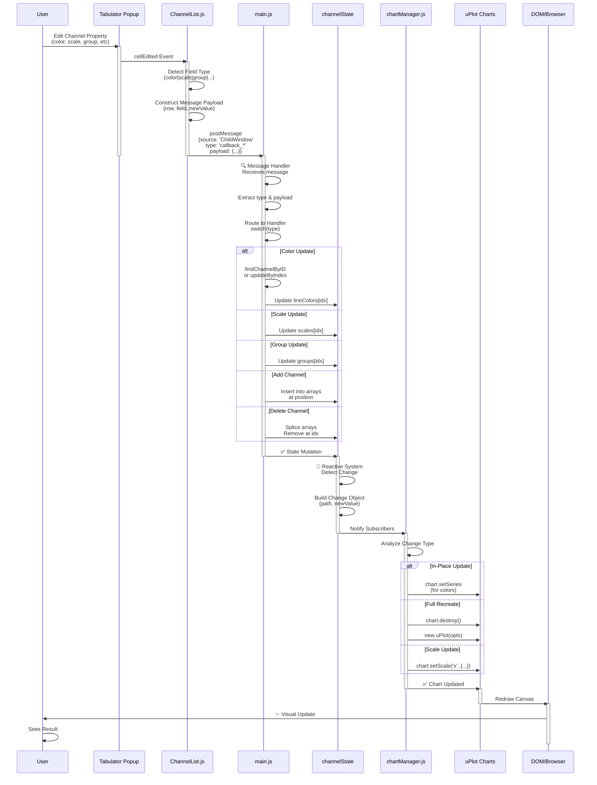
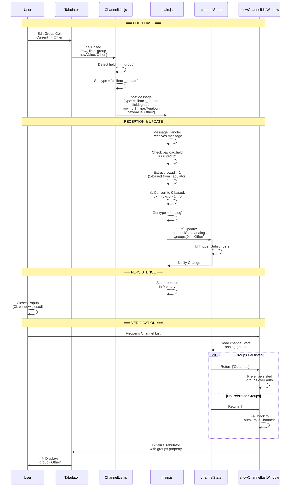
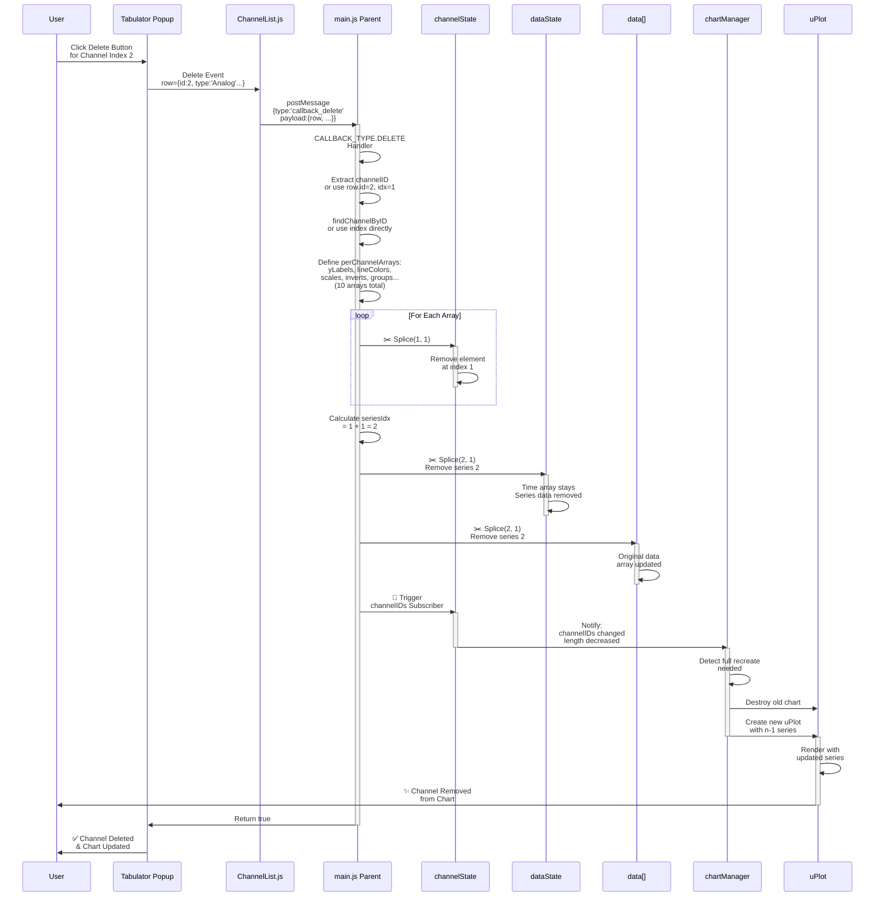
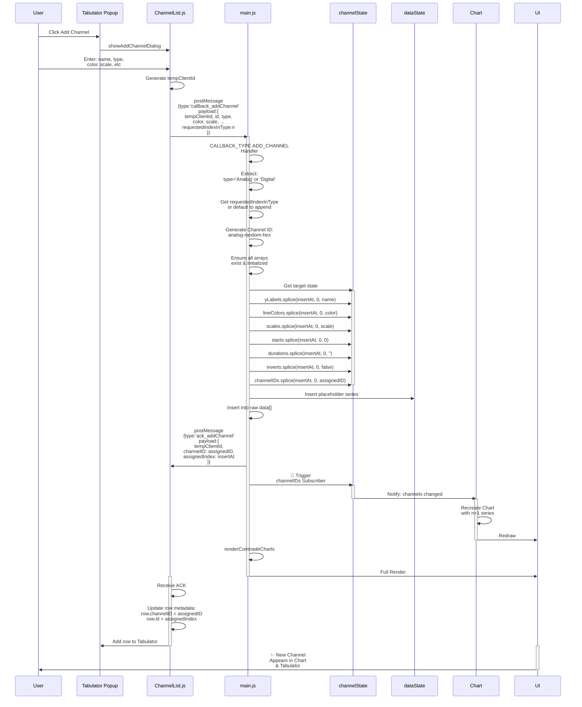
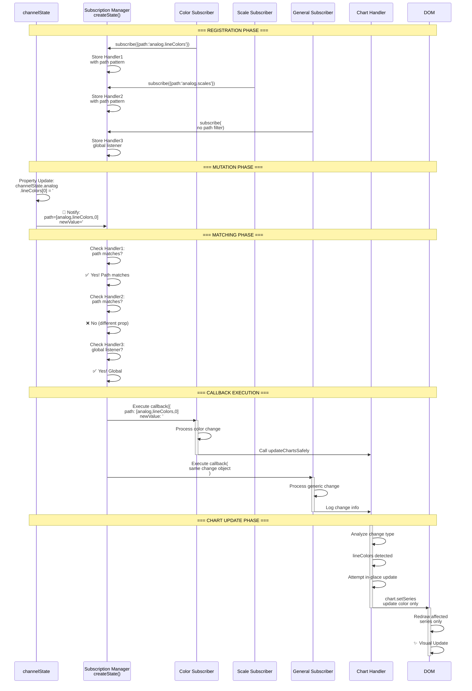
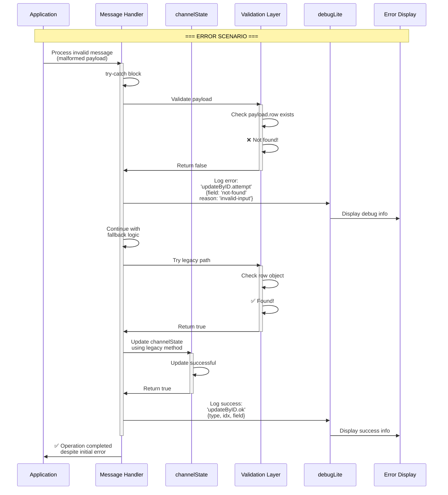
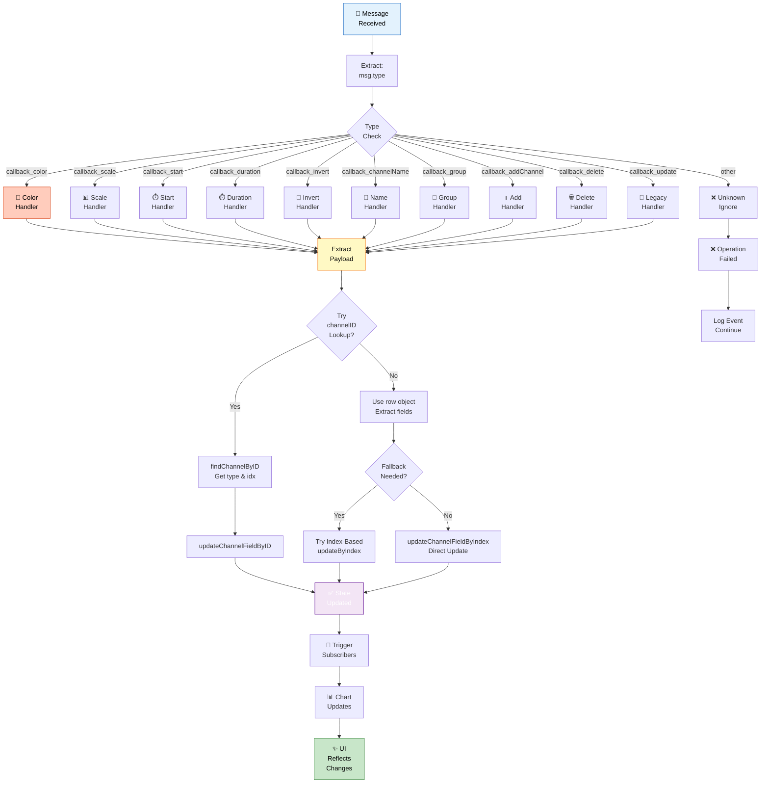
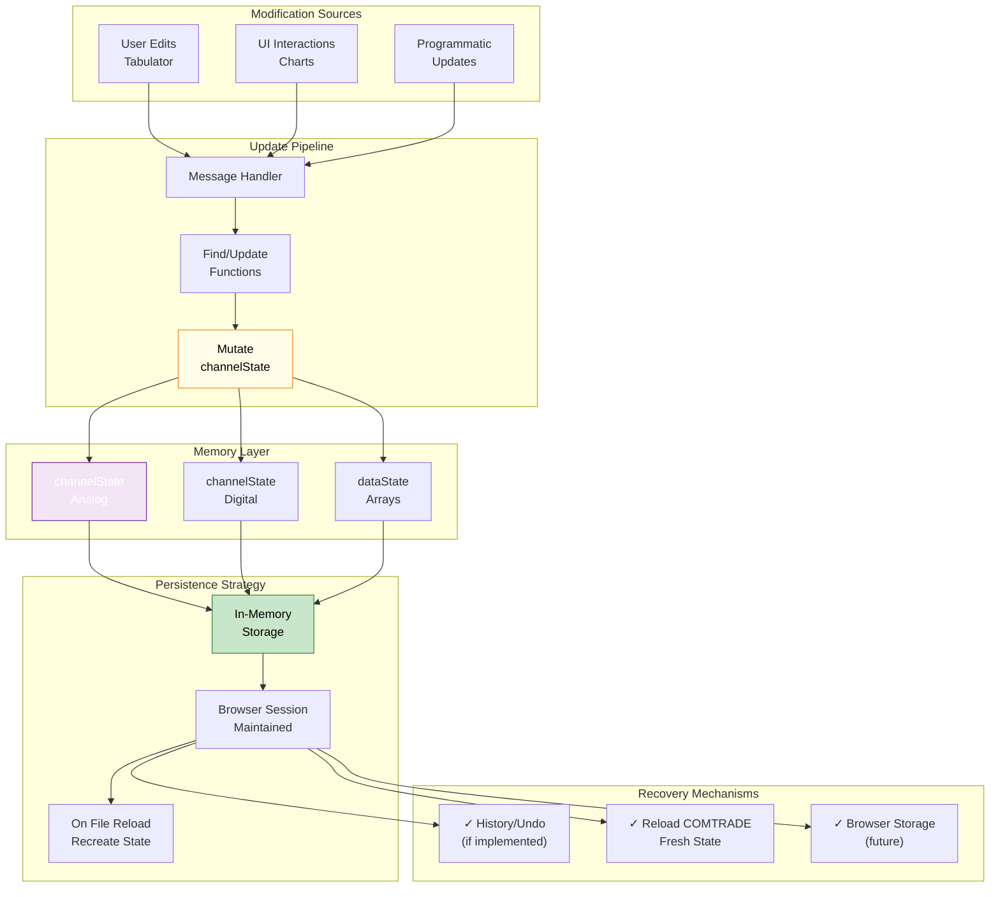
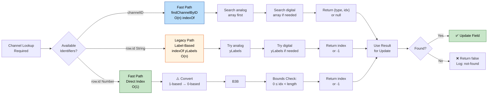
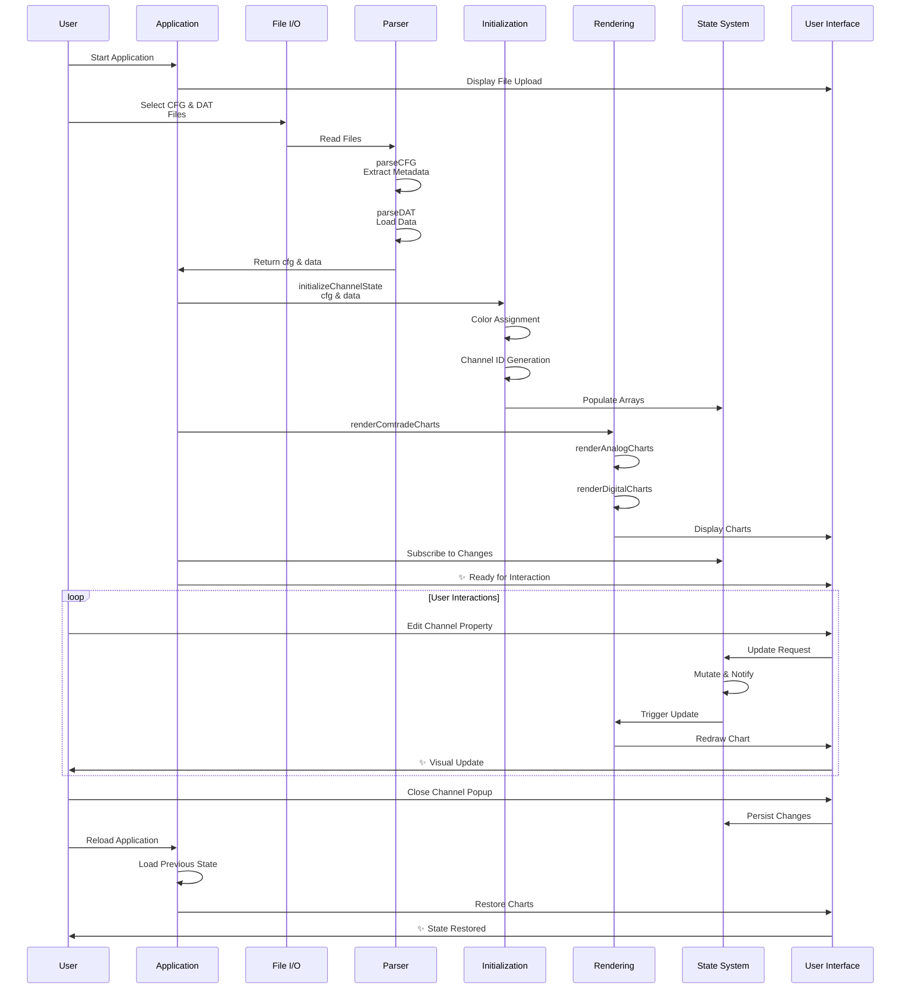

# COMTRADE v1 - Message Sequence Diagrams & Component Interactions

## 21. Complete Message Flow Sequence Diagram

---

## 22. Group Edit Persistence - Complete Sequence

---

## 23. Channel Deletion Cascade

---

## 24. Add Channel Complete Flow

---

## 25. Reactive State Subscriber Pattern - Detailed

---

## 26. Error Propagation & Recovery

---

## 27. Multi-Type Message Handling Router

---

## 28. State Persistence Architecture

---

## 29. Channel Lookup Strategy Comparison

---

## 30. Complete Application Lifecycle

---

**All diagrams are production-ready and feature:**

- ✅ Detailed sequence flows
- ✅ Decision trees and branching logic
- ✅ Multiple interaction pathways
- ✅ Error handling paths
- ✅ Color-coded visual hierarchy
- ✅ Comprehensive labeling
- ✅ Realistic component interactions
- ✅ Based on actual code architecture from JSDoc comments
