# COMTRADE v1 - Message Sequence Diagrams & Component Interactions

## 21. Complete Message Flow Sequence Diagram

---

## 22. Group Edit Persistence - Complete Sequence

```mermaid
sequenceDiagram
    participant User
    participant Tab as Tabulator
    participant CL as ChannelList.js
    participant MainP as main.js
    participant ChState as channelState
    participant showCh as showChannelListWindow

    Note over User,showCh: === EDIT PHASE ===
    User->>Tab: Edit Group Cell<br/>Current → Other
    Tab->>CL: cellEdited<br/>{row, field:'group'<br/>newValue:'Other'}

    CL->>CL: Detect field === 'group'
    CL->>CL: Set type = 'callback_update'
    CL->>MainP: postMessage<br/>{type:'callback_update'<br/>field:'group'<br/>row:{id:1, type:'Analog'}<br/>newValue:'Other'}

    Note over User,showCh: === RECEPTION & UPDATE ===
    MainP->>MainP: Message Handler<br/>Receives message
    MainP->>MainP: Check payload.field<br/>=== 'group'
    MainP->>MainP: Extract row.id = 1<br/>(1-based from Tabulator)
    MainP->>MainP: ⚠️ Convert to 0-based:<br/>idx = row.id - 1 = 0
    MainP->>MainP: Get type = 'analog'

    MainP->>ChState: ✅ Update:<br/>channelState.analog<br/>.groups[0] = 'Other'
    activate ChState
    ChState->>ChState: 🔔 Trigger Subscribers
    ChState->>MainP: Notify Change
    deactivate ChState

    Note over User,showCh: === PERSISTENCE ===
    MainP->>MainP: State remains<br/>in Memory
    User->>User: Closes Popup<br/>(CL window closed)

    Note over User,showCh: === VERIFICATION ===
    User->>showCh: Reopens Channel List
    showCh->>ChState: Read channelState<br/>.analog.groups

    alt Groups Persisted
        ChState->>showCh: Return ['Other', ...]
        showCh->>showCh: Prefer persisted<br/>groups over auto
    else No Persisted Groups
        ChState->>showCh: Return []
        showCh->>showCh: Fall back to<br/>autoGroupChannels
    end

    showCh->>Tab: Initialize Tabulator<br/>with groups property
    Tab->>User: ✨ Displays<br/>group='Other'
```

---

## 23. Channel Deletion Cascade

```mermaid
sequenceDiagram
    participant User
    participant TabPop as Tabulator Popup
    participant CList as ChannelList.js
    participant MainW as main.js Parent
    participant ChState as channelState
    participant DataState as dataState
    participant RawData as data[]
    participant ChartMgr as chartManager
    participant Chart as uPlot

    User->>TabPop: Click Delete Button<br/>for Channel Index 2
    TabPop->>CList: Delete Event<br/>row={id:2, type:'Analog'...}

    CList->>MainW: postMessage<br/>{type:'callback_delete'<br/>payload:{row, ...}}

    activate MainW
    MainW->>MainW: CALLBACK_TYPE.DELETE<br/>Handler

    MainW->>MainW: Extract channelID<br/>or use row.id=2, idx=1
    MainW->>MainW: findChannelByID<br/>or use index directly

    MainW->>MainW: Define perChannelArrays:<br/>yLabels, lineColors,<br/>scales, inverts, groups...<br/>(10 arrays total)

    loop For Each Array
        MainW->>ChState: ✂️ Splice(1, 1)
        activate ChState
        ChState->>ChState: Remove element<br/>at index 1
        deactivate ChState
    end

    MainW->>MainW: Calculate seriesIdx<br/>= 1 + 1 = 2

    MainW->>DataState: ✂️ Splice(2, 1)<br/>Remove series 2
    activate DataState
    DataState->>DataState: Time array stays<br/>Series data removed
    deactivate DataState

    MainW->>RawData: ✂️ Splice(2, 1)<br/>Remove series 2
    activate RawData
    RawData->>RawData: Original data<br/>array updated
    deactivate RawData

    MainW->>ChState: 🔔 Trigger<br/>channelIDs Subscriber
    activate ChState
    ChState->>ChartMgr: Notify:<br/>channelIDs changed<br/>length decreased
    deactivate ChState

    activate ChartMgr
    ChartMgr->>ChartMgr: Detect full recreate<br/>needed
    ChartMgr->>Chart: Destroy old chart
    ChartMgr->>Chart: Create new uPlot<br/>with n-1 series
    deactivate ChartMgr

    activate Chart
    Chart->>Chart: Render with<br/>updated series
    Chart->>User: ✨ Channel Removed<br/>from Chart
    deactivate Chart

    MainW->>TabPop: Return true
    deactivate MainW

    TabPop->>User: ✅ Channel Deleted<br/>& Chart Updated
```

---

## 24. Add Channel Complete Flow

```mermaid
sequenceDiagram
    participant User
    participant TabPop as Tabulator Popup
    participant CList as ChannelList.js
    participant Parent as main.js
    participant ChState as channelState
    participant DataState as dataState
    participant Chart as Chart
    participant UI as UI

    User->>TabPop: Click Add Channel
    TabPop->>CList: showAddChannelDialog

    User->>CList: Enter: name, type,<br/>color, scale, etc
    CList->>CList: Generate tempClientId

    CList->>Parent: postMessage<br/>{type:'callback_addChannel'<br/>payload:{<br/>tempClientId, id, type,<br/>color, scale, ...<br/>requestedIndexInType:n<br/>}}

    activate Parent
    Parent->>Parent: CALLBACK_TYPE.ADD_CHANNEL<br/>Handler

    Parent->>Parent: Extract:<br/>type='Analog' or 'Digital'
    Parent->>Parent: Get requestedIndexInType<br/>or default to append
    Parent->>Parent: Generate Channel ID:<br/>analog-random-hex

    Parent->>Parent: Ensure all arrays<br/>exist & initialized
    Parent->>ChState: Get target state

    activate ChState
    Parent->>ChState: yLabels.splice(insertAt, 0, name)
    Parent->>ChState: lineColors.splice(insertAt, 0, color)
    Parent->>ChState: scales.splice(insertAt, 0, scale)
    Parent->>ChState: starts.splice(insertAt, 0, 0)
    Parent->>ChState: durations.splice(insertAt, 0, '')
    Parent->>ChState: inverts.splice(insertAt, 0, false)
    Parent->>ChState: channelIDs.splice(insertAt, 0, assignedID)
    deactivate ChState

    Parent->>DataState: Insert placeholder series
    Parent->>Parent: Insert into raw data[]

    Parent->>CList: postMessage<br/>{type:'ack_addChannel'<br/>payload:{<br/>tempClientId,<br/>channelID: assignedID,<br/>assignedIndex: insertAt<br/>}}

    Parent->>ChState: 🔔 Trigger<br/>channelIDs Subscriber
    activate ChState
    ChState->>Chart: Notify: channels changed
    deactivate ChState

    activate Chart
    Chart->>Chart: Recreate Chart<br/>with n+1 series
    Chart->>UI: Redraw
    deactivate Chart

    Parent->>Parent: renderComtradeCharts
    Parent->>UI: Full Render

    deactivate Parent

    activate CList
    CList->>CList: Receive ACK
    CList->>CList: Update row metadata:<br/>row.channelID = assignedID<br/>row.id = assignedIndex
    CList->>TabPop: Add row to Tabulator
    deactivate CList

    activate UI
    UI->>User: ✨ New Channel<br/>Appears in Chart<br/>& Tabulator
    deactivate UI
```

---

## 25. Reactive State Subscriber Pattern - Detailed

---

## 26. Error Propagation & Recovery

```mermaid
sequenceDiagram
    participant App as Application
    participant Handler as Message Handler
    participant State as channelState
    participant Validator as Validation Layer
    participant Logger as debugLite
    participant UI as Error Display

    Note over App,UI: === ERROR SCENARIO ===

    App->>Handler: Process invalid message<br/>(malformed payload)

    activate Handler
    Handler->>Handler: try-catch block

    Handler->>Validator: Validate payload
    activate Validator
    Validator->>Validator: Check payload.row exists
    Validator->>Validator: ❌ Not found!
    Validator->>Handler: Return false
    deactivate Validator

    Handler->>Logger: Log error:<br/>'updateByID.attempt'<br/>{field: 'not-found'<br/>reason: 'invalid-input'}

    Logger->>UI: Display debug info

    Handler->>Handler: Continue with<br/>fallback logic

    Handler->>Validator: Try legacy path
    activate Validator
    Validator->>Validator: Check row object
    Validator->>Validator: ✅ Found!
    Validator->>Handler: Return true
    deactivate Validator

    Handler->>State: Update channelState<br/>using legacy method
    activate State
    State->>State: Update successful
    State->>Handler: Return true
    deactivate State

    Handler->>Logger: Log success:<br/>'updateByID.ok'<br/>{type, idx, field}
    Logger->>UI: Display success info

    deactivate Handler

    Handler->>App: ✅ Operation completed<br/>despite initial error
```

---

## 27. Multi-Type Message Handling Router

---

## 28. State Persistence Architecture

```mermaid
graph TB
    subgraph "Memory Layer"
        ML1["channelState<br/>Analog"]
        ML2["channelState<br/>Digital"]
        ML3["dataState<br/>Arrays"]
    end

    subgraph "Modification Sources"
        MS1["User Edits<br/>Tabulator"]
        MS2["UI Interactions<br/>Charts"]
        MS3["Programmatic<br/>Updates"]
    end

    subgraph "Update Pipeline"
        UP1["Message Handler"]
        UP2["Find/Update<br/>Functions"]
        UP3["Mutate<br/>channelState"]
    end

    subgraph "Persistence Strategy"
        PS1["In-Memory<br/>Storage"]
        PS2["Browser Session<br/>Maintained"]
        PS3["On File Reload<br/>Recreate State"]
    end

    subgraph "Recovery Mechanisms"
        RM1["✓ History/Undo<br/>(if implemented)"]
        RM2["✓ Reload COMTRADE<br/>Fresh State"]
        RM3["✓ Browser Storage<br/>(future)"]
    end

    MS1 & MS2 & MS3 --> UP1
    UP1 --> UP2
    UP2 --> UP3

    UP3 --> ML1 & ML2 & ML3

    ML1 & ML2 & ML3 --> PS1
    PS1 --> PS2
    PS2 --> PS3

    PS2 --> RM1 & RM2 & RM3

    style ML1 fill:#F3E5F5,stroke:#6A1B9A,color:#fff
    style UP3 fill:#FFFDE7,stroke:#F57F17,color:#000
    style PS1 fill:#C8E6C9,stroke:#2E7D32,color:#000
```

---

## 29. Channel Lookup Strategy Comparison

```mermaid
graph LR
    A["Channel Lookup<br/>Required"]

    A --> B{Available<br/>Identifiers?}

    B -->|channelID| B1["Fast Path<br/>findChannelByID<br/>O(n) indexOf"]
    B1 --> B1A["Search analog<br/>array first"]
    B1A --> B1B["Search digital<br/>array if needed"]
    B1B --> B1C["Return {type, idx}<br/>or null"]

    B -->|row.id String| B2["Legacy Path<br/>Label-Based<br/>indexOf yLabels<br/>O(n)"]
    B2 --> B2A["Try analog<br/>yLabels"]
    B2A --> B2B["Try digital<br/>yLabels if needed"]
    B2B --> B2C["Return index<br/>or -1"]

    B -->|row.id Number| B3["Fast Path<br/>Direct Index<br/>O(1)"]
    B3 --> B3A["⚠️ Convert<br/>1-based → 0-based"]
    B3B --> B3C["Bounds Check:<br/>0 ≤ idx < length"]
    B3A --> B3B
    B3C --> B3D["Return index<br/>or -1"]

    B1C --> C["Use Result<br/>for Update"]
    B2C --> C
    B3D --> C

    C --> D{Found?}
    D -->|Yes| D1["✅ Update Field"]
    D -->|No| D2["❌ Return false<br/>Log: not-found"]

    style B1 fill:#BBDEFB,stroke:#0D47A1,color:#000
    style B2 fill:#FFF3E0,stroke:#E65100,color:#000
    style B3 fill:#C8E6C9,stroke:#1B5E20,color:#000
    style D1 fill:#C8E6C9,stroke:#2E7D32,color:#000
```

---

## 30. Complete Application Lifecycle

---

**All diagrams are production-ready and feature:**

- ✅ Detailed sequence flows
- ✅ Decision trees and branching logic
- ✅ Multiple interaction pathways
- ✅ Error handling paths
- ✅ Color-coded visual hierarchy
- ✅ Comprehensive labeling
- ✅ Realistic component interactions
- ✅ Based on actual code architecture from JSDoc comments
