# COMTRADE v1 - System Flowcharts & Architecture Diagrams

## 1. Main Application Initialization Flow

```mermaid
flowchart TD
    A["🚀 Application Start"] --> B{"User Selects<br/>CFG & DAT Files"}
    B -->|Files Selected| C["📁 Parse CFG File"]
    B -->|No Files| D["⚠️ Show Error<br/>File not found"]
    D --> B

    C --> E["🔍 Validate CFG<br/>Extract Metadata"]
    E --> F{"Valid<br/>Format?"}
    F -->|Invalid| D
    F -->|Valid| G["📊 Parse DAT File<br/>Load Channel Data"]

    G --> H["✅ Create dataState<br/>analog[] & digital[]"]
    H --> I["🔧 Initialize channelState<br/>Suspend History"]

    I --> J["🎨 Assign Colors<br/>from Palette"]
    J --> K["🆔 Generate Channel IDs<br/>Unique Identifiers"]
    K --> L["📝 Populate Arrays:<br/>yLabels, lineColors,<br/>scales, inverts, groups"]

    L --> M["Resume History"]
    M --> N["📈 Render Analog Charts"]
    N --> O["📉 Render Digital Charts"]
    O --> P["🎯 Apply Start/Duration<br/>Windows to Charts"]

    P --> Q["🔗 Subscribe to<br/>Reactive Updates"]
    Q --> R["✨ Setup Drag & Drop<br/>Handlers"]
    R --> S["🎉 Application Ready"]

    style A fill:#4CAF50,stroke:#2E7D32,color:#fff
    style D fill:#F44336,stroke:#C62828,color:#fff
    style S fill:#4CAF50,stroke:#2E7D32,color:#fff
    style I fill:#2196F3,stroke:#1565C0,color:#fff
    style M fill:#2196F3,stroke:#1565C0,color:#fff
```

---

## 2. Channel Lookup & Update Flow

---

## 3. Child-to-Parent Message Handling Flow

---

## 4. Channel State Update & Reactive Subscription Flow

```mermaid
flowchart TD
    subgraph "State Mutation"
        M1["1️⃣ channelState Updated<br/>e.g., lineColors[idx] = newValue"]
        M2["2️⃣ Reactive System<br/>Detects Change"]
        M3["3️⃣ Validate Path<br/>[type, property, index]"]
    end

    subgraph "Subscriber Notification"
        S1["4️⃣ Notify All Subscribers<br/>via subscribe callback"]
        S2["Pass Change Object:<br/>{path, newValue,<br/>oldValue}"]
    end

    subgraph "Chart Update Routing"
        R1{"5️⃣ Property<br/>Type?"}
        R1 -->|lineColors| R2["🎨 In-Place Update<br/>chart.setSeries"]
        R1 -->|yLabels| R3["📝 In-Place Update<br/>Legend Refresh"]
        R1 -->|scales| R4["📊 Full Recreate<br/>Scale Factor Changed"]
        R1 -->|inverts| R5["🔄 Full Recreate<br/>Data Recalculation"]
        R1 -->|starts/durations| R6["⏱️ X-Axis Scale<br/>chart.setScale('x')"]
        R1 -->|channelIDs| R7["🔗 Full Recreate<br/>Channel Structure Changed"]
    end

    subgraph "Visual Update"
        V1["6️⃣ requestAnimationFrame<br/>Schedule Render"]
        V2["7️⃣ Chart Redraw<br/>or Recreate"]
        V3["✨ UI Reflects<br/>New State"]
    end

    M1 --> M2 --> M3 --> S1 --> S2
    S2 --> R1
    R2 --> V1
    R3 --> V1
    R4 --> V1
    R5 --> V1
    R6 --> V1
    R7 --> V1
    V1 --> V2 --> V3

    style M1 fill:#F3E5F5,stroke:#6A1B9A,color:#000
    style S1 fill:#E8EAF6,stroke:#283593,color:#000
    style V3 fill:#C8E6C9,stroke:#2E7D32,color:#000
    style R2 fill:#BBDEFB,stroke:#1565C0,color:#000
    style R4 fill:#FFE0B2,stroke:#E65100,color:#000
```

---

## 5. Channel Deletion Complete Flow

```mermaid
flowchart TD
    A["🗑️ User Requests<br/>Channel Deletion"]
    A --> B["Pass channelID<br/>to deleteChannelByID"]

    B --> C["Find Channel<br/>using findChannelByID"]
    C --> D{"Channel<br/>Exists?"}
    D -->|No| E["Return: false<br/>No Action"]
    D -->|Yes| F["Extract type & index<br/>from location"]

    F --> G["Define Per-Channel<br/>Arrays to Splice:<br/>yLabels, lineColors,<br/>yUnits, groups,<br/>scales, starts,<br/>durations, inverts,<br/>channelIDs"]

    G --> H["🔀 Splice Each Array<br/>at index position"]
    H --> I["Remove from dataState<br/>series array"]
    I --> J["Remove from raw data<br/>series array"]

    J --> K["✅ Trigger channelIDs<br/>Subscriber"]
    K --> L["📊 Chart Recreates<br/>with Updated Series"]
    L --> M["Return: true<br/>Success"]

    style A fill:#F44336,stroke:#B71C1C,color:#fff
    style E fill:#FFCDD2,stroke:#C62828,color:#000
    style M fill:#C8E6C9,stroke:#2E7D32,color:#000
    style G fill:#FFF9C4,stroke:#F57F17,color:#000
    style K fill:#2196F3,stroke:#0D47A1,color:#fff
```

---

## 6. Channel State Initialization Flow

```mermaid
flowchart TD
    A["🎯 initializeChannelState<br/>Called After File Load"]
    A --> B["📋 Get Palette Row<br/>Based on Background Mode"]
    B --> C["Initialize Analog<br/>Channel Arrays"]

    subgraph "Analog Initialization"
        C1["Clear All Arrays<br/>length = 0"]
        C2["Create Empty<br/>channelIDs array"]
        C3["Add Base axesScale<br/>value: 1e-6"]
        C4["For Each Analog Channel:<br/>idx ∈ [0..n)"]
        C5["🎨 Assign Color<br/>from Palette[paletteIdx]"]
        C6["📝 Push to Arrays:<br/>yLabels, lineColors,<br/>yUnits, scales,<br/>starts, durations,<br/>inverts"]
        C7["🆔 Generate ChannelID<br/>if missing"]
        C8["💾 Store ChannelID"]
        C9["Increment Palette<br/>Index"]
        C1 --> C2 --> C3 --> C4 --> C5 --> C6 --> C7 --> C8 --> C9
    end

    C --> C1
    C9 --> D["Set Axis Labels<br/>xLabel='Time'<br/>xUnit='sec'"]

    D --> E["Initialize Digital<br/>Channel Arrays<br/>Same Process"]

    E --> F["✅ channelState<br/>Fully Populated"]
    F --> G["🔔 All Arrays<br/>Synchronized<br/>Same Length"]
    G --> H["📊 Ready for<br/>Chart Rendering"]

    style A fill:#4CAF50,stroke:#1B5E20,color:#fff
    style C fill:#BBDEFB,stroke:#1565C0,color:#000
    style E fill:#BBDEFB,stroke:#1565C0,color:#000
    style F fill:#C8E6C9,stroke:#2E7D32,color:#000
    style H fill:#4CAF50,stroke:#1B5E20,color:#fff
```

---

## 7. Group Update & Persistence Flow

```mermaid
flowchart LR
    subgraph "User Action in Tabulator"
        U1["👤 Edit Group Name<br/>in Tabulator Cell"]
        U2["cellEdited Event<br/>row, field='group'"]
        U3["Extract row Data:<br/>id, type, newValue"]
    end

    subgraph "Message Construction"
        M1["Detect Field Type<br/>= 'group'"]
        M2["Set Message Type:<br/>callback_group or<br/>callback_update"]
        M3["Build Payload:<br/>{row, newValue}"]
        M4["📤 postMessage"]
    end

    subgraph "Parent Reception"
        P1["📨 Message Handler<br/>Receives callback_update"]
        P2{"Check<br/>field ===<br/>'group'?"}
        P3["Extract row.type<br/>& row.id"]
        P4{"row.id<br/>Type?"}
        P4 -->|String| P5["Label-Based Lookup<br/>indexOf in yLabels"]
        P4 -->|Number| P6["⚠️ 1-Based Index<br/>Convert to 0-Based:<br/>idx = row.id - 1"]
        P5 --> P7["Find Index"]
        P6 --> P7
    end

    subgraph "State Update"
        S1["🔍 Get Type Section:<br/>channelState[type]"]
        S2["Ensure groups array<br/>exists"]
        S3["✅ Update:<br/>groups[idx] = newGroup"]
        S4["🔔 Trigger Subscribers"]
    end

    subgraph "Persistence & UI"
        F1["💾 State Persisted<br/>on next reload"]
        F2["Tabulator Re-Opens"]
        F3["showChannelListWindow<br/>Reads from<br/>channelState.groups"]
        F4["✨ Edited Group Name<br/>Displays in Tabulator"]
    end

    U1 --> U2 --> U3 --> M1 --> M2 --> M3 --> M4
    P1 --> P2 -->|Yes| P3 --> P4
    P7 --> S1 --> S2 --> S3 --> S4
    S4 --> F1 --> F2 --> F3 --> F4

    style U1 fill:#FFF3E0,stroke:#E65100,color:#000
    style M4 fill:#FFE0B2,stroke:#E65100,color:#000
    style P1 fill:#E3F2FD,stroke:#1565C0,color:#000
    style S3 fill:#F3E5F5,stroke:#6A1B9A,color:#fff
    style F4 fill:#C8E6C9,stroke:#2E7D32,color:#000
```

---

## 8. Digital Chart Rendering with Label Mapping

```mermaid
flowchart TD
    A["📉 renderDigitalCharts<br/>Function Invoked"]
    A --> B["Find Changed<br/>Digital Channels<br/>findChangedDigitalChannelIndices"]

    B --> C["📋 Build Channel List<br/>Keep originalIndex"]
    C --> D["digitalChannelsToShow = [{<br/>...cfg.digitalChannels[i],<br/>originalIndex: i<br/>}]"]

    D --> E["Extract Visual Props<br/>from channelState:<br/>yLabels, lineColors,<br/>yUnits"]

    E --> F["🔍 Map Indices to Colors<br/>Using originalIndex:<br/>displayedColors =<br/>lineColors[originalIndex]"]

    F --> G["🎯 Create Drag Bar<br/>Pass indices:<br/>originalIndex → lookup<br/>in channelState"]

    G --> H["📊 Build Chart Data<br/>time[] + digital[]"]

    H --> I["🖼️ Create Chart Options<br/>with correct labels<br/>from channelState"]

    I --> J["Initialize uPlot<br/>Chart Instance"]

    J --> K["✅ Digital Chart<br/>Renders with<br/>Correct Labels"]

    style A fill:#FF6F00,stroke:#E65100,color:#fff
    style C fill:#BBDEFB,stroke:#1565C0,color:#000
    style F fill:#FFF9C4,stroke:#F57F17,color:#000
    style G fill:#F8BBD0,stroke:#880E4F,color:#000
    style K fill:#C8E6C9,stroke:#2E7D32,color:#000
```

---

## 9. Complete Message Handling Switch Statement Flow

```mermaid
flowchart TD
    A["📨 Message from Child<br/>type & payload received"]
    A --> B{"Switch<br/>Message Type"}

    B -->|COLOR| C["🎨 updateChannelFieldByID<br/>fieldName='lineColors'"]
    B -->|SCALE| D["📊 updateChannelFieldByID<br/>fieldName='scales'"]
    B -->|START| E["⏱️ updateChannelFieldByID<br/>fieldName='starts'"]
    B -->|DURATION| F["⏱️ updateChannelFieldByID<br/>fieldName='durations'"]
    B -->|INVERT| G["🔄 updateChannelFieldByID<br/>fieldName='inverts'"]
    B -->|CHANNEL_NAME| H["📝 updateChannelFieldByID<br/>fieldName='yLabels'"]
    B -->|GROUP| I["👥 Update groups<br/>array by index"]
    B -->|ADD_CHANNEL| J["➕ Add New Channel<br/>Insert into arrays"]
    B -->|DELETE| K["🗑️ Delete Channel<br/>Splice arrays"]
    B -->|callback_update| L["🔄 Legacy Handler<br/>Inspect field property"]

    C --> M["✅ channelState<br/>Updated"]
    D --> M
    E --> M
    F --> M
    G --> M
    H --> M
    I --> M
    J --> M
    K --> M
    L --> M

    M --> N["🔔 Notify Subscribers"]
    N --> O["📈 Chart Updates"]

    B -->|Unknown| P["❌ Ignore Message"]

    style A fill:#E3F2FD,stroke:#1565C0,color:#000
    style M fill:#C8E6C9,stroke:#2E7D32,color:#000
    style N fill:#2196F3,stroke:#0D47A1,color:#fff
    style P fill:#FFCDD2,stroke:#C62828,color:#000
```

---

## 10. Reactive Subscriber Pattern

---

## System Architecture Overview

